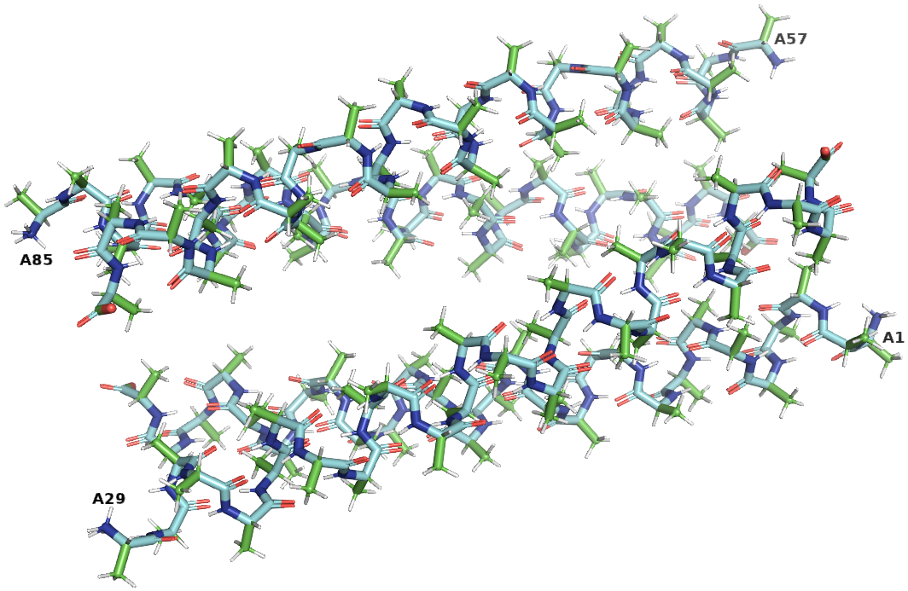

# CCCP (Coiled-coil Crick Parameterization) PDB Modifier

CCCP generated poly-gly and poly-ala PDBs (protein data bank files) from the
[Grigoryan lab][1] web server need to be modified before they can be used in
some cases. Namely their segment IDs match their chain IDs (i.e. in PyMOL it is
/A/A, /B/B etc) which can raise issues, each chain is numbered from 1 which may
not be suitable and the poly-ala chains do not posses side chains. This script
modifies the generated bundles by renumbering the chains so they are
continuous, setting the segment ID's equal and combining the chains into one
continuous chain with gaps between chains that can be filled via loop
stitching or other methods.

The segment IDs can be changed to all of the same through segID, multiple
chains are supported (in the form of 'A B ... X Y Z', chain IDs are changed
to all of the same through chainID and the residues per chain are incremented
so that they are continuous (for example, if all chains are 28 residues long,
then chain A is untouched and chain B will start from 29 instead of 1, chain
C from 57 etc). The path to the CCCP generated bundles must be the full path.

The paths to the Rosetta /bin/, Rosetta /database/ and phenix /bin/ must be
set before running the script. The CCCP server pads their files i.e. 00001, 00002...file.pdb so order is guaranteed with the original PDBs.

The CCCP server can be found on the [Grigoryan lab website][1] where
they were also kind enough to provide MATLAB files that also generate backbone
atoms. The CCCP literature by the Grigoryan lab can be found in reference (1).

After modification and overlaying with the original CCCP PDB file, it can be
seen that the green side chain of the modified residue is present and
continuous residue numbering is present:



## Installation

The `modify_cccp_bundles.sh` file can be downloaded as-is and run from a known
location with a full path reference to CCCP bundles for residues per chain data
is known. Dependencies information can be found within the `/dep/` dir above.

## Usage

After installing the dependencies, generating CCCP poly-gly and poly-ala
backbones or using the example structures contained within
`/example/input/CCCP/`and downloading the `modify_cccp_bundles.sh` file into a
location that the terminal is active in, the bash script can be called with:

```bash
    $ source ~/set_Phenix.sh
    $ source ~/set_Rosetta.sh
    $ bash modify_cccp_bundles.sh -p "/home/username/Desktop/CCCP" -r 28
```

Depending on the amount of backbones used, it takes on my Linux system around
~30 secs to run two sets of poly-gly/ala backbones and 64 sets takes ~15 mins.

### Mandatory arguments

The full path to the CCCP bundle directory (`-p`) is required as well as the
number of residues per chain (`-r`) in the bundles. If either one is not
present, or if `-r` is less than or equal to 0, an error is raised and the
programme is aborted.

```bash
    -p  full path to CCCP bundle directory (mandatory: str)
    -r  residues per chain (mandatory: int)
```

### Optional arguments

The optional arguments are:

```bash
    -s  set segment ID to value (default: 'A')
    -z  chains list (default: 'A B C D')
    -c  set all chain IDs to value (default: 'A')
    -e  dir separator in CCCP dir i.e. poly-, poly_ (default: 'poly-')
    -a  residue names list (default: 'ala gly')
    -v  output logging to screen, must be either 0 for output (default) or 1
    -h  show this help message
```

If `-v`, verbosity, is not 0 for output or 1 for silent mode then an error is
raised and the programme aborted.

## Issues

If there are any issues, please open an issue or pull request.

## To-do

The following will be added in time:

* add support for relative paths although perhaps this is Rosetta/Phenix
* add modifications to handle residues that are not glycine or alanine

## References

(1) G. Grigoryan, W. F. DeGrado, "Probing Designability via a Generalized Model
    of Helical Bundle Geometry", J. Mol. Biol., 405(4): 1079-1100 (2011)

[Grigoryan lab CCCP Server](https://www.grigoryanlab.org/cccp/)

[Rosetta commons website](https://www.rosettacommons.org/)

[Phenix tools website](https://phenix-online.org/)

[1]:(https://www.grigoryanlab.org/cccp/)
